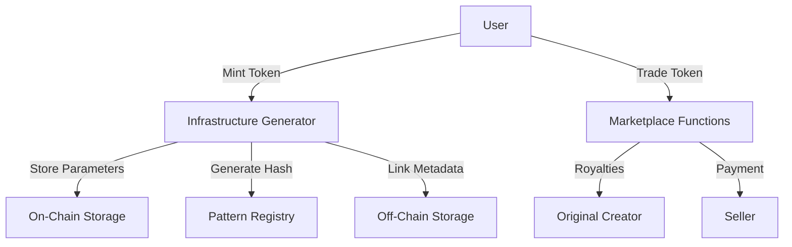

# Tested Infrastructure Generator

A robust platform for creating, minting, and trading unique infrastructure-based digital assets as tokens on the Stacks blockchain. The platform generates distinctive infrastructure patterns with user-defined parameters, ensuring each token has verifiable provenance and traceability.

## Overview

Tested Infrastructure enables users to:
- Create unique infrastructure-based digital assets
- Mint tokens with verifiable on-chain parameters
- Trade tokens with built-in royalty support
- Verify the uniqueness of each infrastructure pattern

The system stores generation parameters on-chain while maintaining the detailed representation off-chain as metadata, providing an efficient balance between transparency and computational efficiency.

## Architecture

The smart contract system is built around a core token contract that implements advanced token standards while adding specialized functionality for infrastructure pattern generation and trading.



## Contract Documentation

### Infrastructure Generator Contract

The main contract handling token operations and marketplace functionality.

#### Key Features
- Infrastructure parameter storage and verification
- Automated royalty distribution
- Advanced marketplace functionality
- Uniqueness verification through parameter hashing

#### Access Control
- Minting: Open to all users (requires payment)
- Trading: Restricted to token owners
- Admin functions: Limited to contract owner

## Getting Started

### Prerequisites
- Clarinet
- Stacks wallet
- STX tokens for minting and trading

### Basic Usage

1. Mint a new Lattice NFT:
```clarity
(contract-call? .lattice-mint mint-lattice
    u12345                     ;; seed
    "hexagonal"               ;; lattice-type
    u100                      ;; width
    u100                      ;; height
    u5                        ;; complexity
    "blue"                    ;; primary color
    "red"                     ;; secondary color
    "white"                   ;; background color
    "https://metadata.uri"    ;; metadata URI
)
```

2. List an NFT for sale:
```clarity
(contract-call? .lattice-mint list-for-sale
    u1              ;; token-id
    u100000000      ;; price (in STX)
    u1000           ;; expiry block height
)
```

## Function Reference

### Minting Functions

```clarity
(mint-lattice (seed uint) 
              (lattice-type (string-utf8 20))
              (width uint)
              (height uint)
              (complexity uint)
              (primary (string-utf8 20))
              (secondary (string-utf8 20))
              (background (string-utf8 20))
              (metadata-uri (string-ascii 256)))
```

### Trading Functions

```clarity
(list-for-sale (token-id uint) (price uint) (expiry uint))
(purchase (token-id uint))
(cancel-listing (token-id uint))
(transfer (token-id uint) (sender principal) (recipient principal))
```

### Query Functions

```clarity
(get-owner (token-id uint))
(get-token-uri (token-id uint))
(get-lattice-parameters (token-id uint))
(get-listing (token-id uint))
(pattern-exists (seed uint) ...)
```

## Development

### Testing
Run the following commands in your project directory:
```bash
clarinet test
clarinet check
```

### Local Development
1. Clone the repository
2. Install Clarinet
3. Run `clarinet console` for interactive testing

## Security Considerations

### Known Limitations
- Pattern uniqueness is based on exact parameter matches
- Metadata URI changes are not restricted
- Listing expiry based on block height

### Best Practices
- Verify pattern uniqueness before minting
- Check listing validity before purchasing
- Always verify token ownership before transactions
- Use secure metadata storage solutions

### Royalty Structure
- Fixed 5% royalty on all secondary sales
- Automatically distributed to original creator
- Maximum royalty cap of 30%